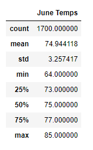
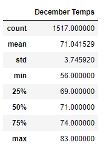

# surfs_up

## Overview:

The purpose of this analysis is to look at the weather in Oahu for the months of June and December to determine if an ice cream business would be sustainable year-round. 

## Results:

### The results of the analysis were as follows:

       

### - The average weather in June is only 4 degrees warmer than the average weather in December
### - The lowest temperature in December was 56 degrees, while the lowest temperature in June was 64 degrees
### - The max tempurature in December is 83 degrees

## Results:

### Based on the analysis performed, an ice cream shop would be a sustainable year-round business in Oahu. 

